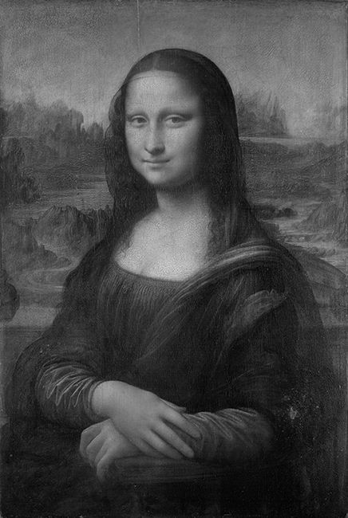
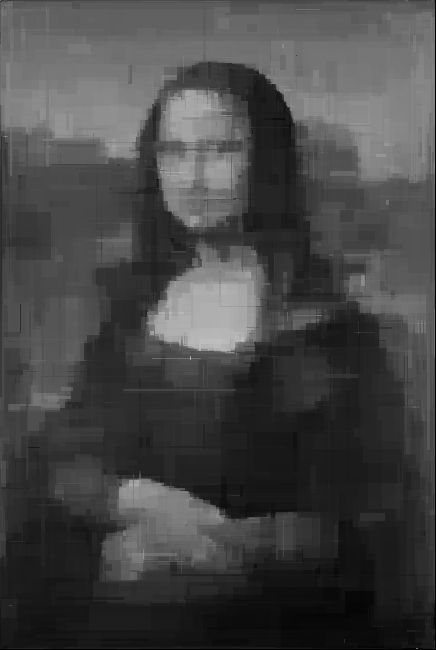

Implementacja algorytmu genetycznego
====================================

Program napisany w C++, który przy pomocy prostej wersji algorytmu genetycznego ma za zadanie utworzyć obraz za pomocą tworzenia prostokątów o losowych rozmiarach i intensywności podobny do oryginalnego, wejściowego obrazu.

Program nie modyfikuje oryginalnego obrazu. Obraz wynikowy jest tworzony od początku i co pokolenie (iterację działania algorytmu) dodaje dodatkowe elementy obrazu.

Plik wejściowy musi być 8-bitowym monochromatycznym surowym obrazem (tj. bez żadnych metadanych). Nazwę pliku i rozmiar (szerokość i długość) podaje się w linii poleceń:

GenAlg.exe mona.raw 436 650

Program co 500 generacji zapisuje wynik najlepszego okazu do katalogu out.

Działanie algorytmu
-------------------

Działanie algorytmu zaimplementowanego jest stosunkowo proste i składa się z trzech etapów:
1. Mutacji osobników
  - Operacja ta polega na narysowaniu prostokąta o losowych wymiarach i losowej intensywności - od białego do czarnego
2. Oceny osobników
  - Porównanie osobnika do oryginalnego obrazu. W programie wykorzystywana jest do tego celu ocena polegająca na sumie błędu średniokwadratowego (kwadratu różnicy kolorów) dla każdego piksela obrazu. Czym mniejsza wartość liczbowa takiej oceny, tym bliższy oryginałowi jest wygenerowany obraz
3. Krzyżowania osobników
  - Krzyżowanie osobników powinno polegać na łączeniu najlepszych osobników, jednak dla uproszczenia w algorytmie posługuję się kopiowaniem najlepszych osobników na całą populację

Przykład
--------
Poniżej znajduje się przykładowy obraz prezentujący działanie algorytmu:

Oryginalny obraz:

Obraz wygenerowany algorytmem genetycznym (pokolenie 98500)

