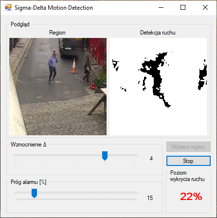

Sigma Delta Motion Detection
============================

Sigma Delta Motion Detection jest programem napisanym w języku C# z wykorzystaniem Windows Forms, który umożliwia wykrycie ruchu na fragmencie ekranu i sygnalizację tego zdarzenia alarmem. Próg alarmu jak i czułość na wykrycie (parametr wzmocnienie Δ) ustalany jest przez użytkownika. Użytkownik za pomocą przycisku 'wybierz region' może wybrać fragment ekranu, który program ma obserwować w poszukiwaniu ruchu.

Program implementuje algorytm wykrywania ruchu bazujący na publikacji:
> Antoine Manzanera, Julien Richefeu. A robust and computationally efficient motion detection algorithm based on sigma-delta background estimation. Indian Conference on Computer Vision, Graphicsand Image Processing (ICVGIP’04), Dec 2004, Kolkata, India.