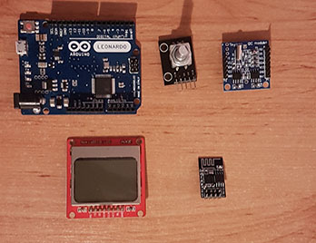

LCD WEATHER STATION
===
Projekt ten jest prostą "stacją pogodową" zbudowaną w celach hobbystycznych na platformę Arduino Leonardo i mających na celu sprawdzenie, czy system przy tylu działających komponentach i takim poziomie abstrakcji jest w stanie funkcjonować w ograniczonym zasobowo środowisku, jakim jest Arduino Leonardo. Projekt napisany przy użyciu C++ oraz ogólnodostępnych bibliotek obsługujących różne sprzętowe moduły.

Program ten w regularnych odstępach czasu odczytuje temperaturę z sensora temperatury (DS18B20) i za pomocą sieci bezprzewodowej WiFi wysyła dane do chmury na platformę ThingSpeak, gdzie każdy użytkownik może publicznie odczytać zgromadzone dane w wybranym czasie. Dodatkowo na wyświetlaczu wyświetla obecną datę i godzinę oraz odczyt z sensora temperatury. Przy każdym uruchomieniu urządzenia data jest synchronizowana z serwerem czasu poprzez protokół NTP.

Stworzony układ obecnie został zdementowany na części pierwsze i nie jest w użyciu. Jednak wysyłanie temperatury na platformę ThingSpeak przeniosłem na Raspberry Pi i opisałem w innym projekcie (owreader). Pomiary dostępne są na stronie https://thingspeak.com/channels/82797

Główne moduły użyte w projekcie:
- Arduino Leonardo - płytka z mikroprocesorem ATmega32u4, która stanowi serce obliczeniowe całego projektu,
- Zegar czasu rzeczywistego podtrzymywany baterią, bazujący na układzie DS1307,
- Układ ESP8266 do komunikacji bezprzewodowej WiFi,
- Enkoder obrotowy z przyciskiem jako narzędzie wejścia do sterowania programem przez użytkownika,
- Wyświetlacz z telefonu NOKIA 5110 (zgodny ze sterownikiem PCD8544),
- Sensor temperatury DS18B20 do pomiaru temperatury.

Z punktu widzenia programu stworzona została architektura, której celem miało być wyabsrahowanie widoku wyświetlacza zawierającego różne komponenty - innymi słowy stworzenie prostego systemu GUI. W tym celu powstały abstrakcje:
* View, czyli konkretny widok wyświetlacza (analogia okienka np. w Windows)
* ViewManager - prosta klasa pozwalająca na zdefiniowanie różnych widoków i przełączanie się między nimi
* Component - abstrakcja elementu gui, jak np. etykieta, przycisk, ale także również elementy niewidoczne, jak np. Timer. Każdy komponent może przeciążyć dowolną funkcję reagującą na pewne zdarzenia, jak np. wybranie elementu za pomocą enkodera obrotowego oraz przyciśnięcie przycisku. Każdy komponent też przeciąża funkcję draw, która to implementuje wygląd komponentu na ekranie wyświetlacza.

Opis programowych komponentów:
* LabelComponent, ButtonComponent, CheckBoxComponent - implementują podstawową funkcjonalność z programów z GUI, czyli etykietę, przycisk oraz przycisk wyboru (check box),
* NumUpDownComponent - komponent, który pozwala wybrać za pomocą enkodera liczbę całkowitą z zadanego zakresu, zwiększając ją o jeden w przypadku przekręcenia enkodera zgodnie ze wskazówkami zegara, albo zmniejszając, jeżeli obrót nastąpił w przeciwnym kierunku,
* RtcComponent - komponent czasu rzeczywistego, wyświetla aktualną datę oraz godzinę,
* TemperatureComponent - komponent sensora temperatury DS18B20, wyświetla napis z odczytaną temperaturą,
* TimerComponent - prosty Timer, czyli komponent zliczający czas i uruchamiający funkcję (callback) co pewien interwał.

