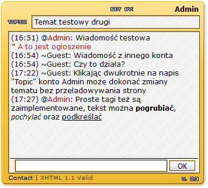

Shoutbox
===

### Demo
https://kmach.ga/demo/shoutbox/

Jest to jeden z pierwszych projektów jakie miałem okazję stworzyć. Projekt powstał w okolicach 2006 roku. Założeniem projektu miało być stworzenie prostego czatu (shoutbox) na prywatną stronę internetową, popularnego w ówczesnych czasach.

Rejestracja była zamknięta i tworzyłem konto tylko na podstawie przesłanej mi prośby, w związku z tym nie posiada funkcjonalności rejestracji użytkowników.

Każdy, kto miał założone konto miał przydzielone:
- nazwę użytkownika,
- poziom użytkownika, który definiował czy użytkownik może korzystać ze specjalnych komend (/ann do dodawania wiadomości ogólnej) oraz zmiany tematu na czacie,
- kolor nazwy użytkownika,
- znak ozdobny, który pojawia się przed nazwą użytkownika (miało to na celu odróżnić użytkowników o poszczególnych uprawnieniach),

Dodatkowo użytkownik poprzez kliknięcie dwukrotnie na napis 'topic' mógł zmieniać temat bez przeładowywania strony - tekstowa wartość zamieniała się w inputboxa, który umożliwiał wprowadzenie nowego tematu. 

Użytkownik mógł wyróżnić fragmenty swojej wiadomość poprzez użycie tagów znanych z for internetowych, czyli [b]TEKST[/b] dla pogrubienia, [i]TEKST[/i] dla pochylenia oraz [u]TEKST[/u] dla podkreślenia.

Wykorzystane technologie:
- PHP 5,
- SQL (jako system bazodanowy wykorzystałem MySQL)
- jQuery - do zapytań AJAX oraz prostych animacji,
- XHTML 1.1, najnowszy w użyciu standard jak na 2006 rok,
- CSS

Projekt ten na współczesne czasy może nie wydawać się imponujący, głównie ze względu na postęp technologiczny jaki dokonał się od 2006 roku. Jednak w momencie jego tworzenia byłem dumny z:
- zapytań asynchroniczne AJAX realizowanych przy pomocy jQuery. Pozwoliły one na wysyłanie i odbieranie wiadomości, logowanie oraz zmianę tematu bez konieczności przeładowywania strony,
- prosty system szablonowy, który pozwolił w dużej mierze wyodrębnić wygląd strony (HTML, CSS) z głównego kodu aplikacji. Pozwoliło to także na zdefiniowanie wielu wyglądów dla aplikacji, z których użytkownik mógłby wybierać swój ulubiony.

Rzeczy które należałoby poprawić:
- mimo systemu szablonowego, w kodzie wciąż pojawiają się fragmenty HTML, które najlepiej byłoby wyodrębnić na zewnątrz,
- nie została dokonana pełna normalizacja bazy danych. W momencie projektowania uznałem to za dobry sposób na zachowanie treści w momencie żądania użytkownika do usunięcia konta na stronie. Jednak obecnie znormalizowałbym wszystkie tabele i określił odpowiednie relacje między tabelami, a problem z usunięciem konta rozwiązałbym albo poprzez dodatkową kolumnę, w której znalazłaby się informacja czy konto zostało usunięte (tzw. soft delete), albo poprzez faktyczne usunięcie rekordu z tabeli i animizację wszystkich wiadomości należących do tego konta
